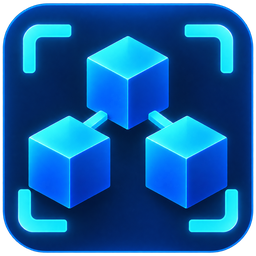

# DeFCoN Explorer

[](https://github.com/defcon-project/explorer/actions/workflows/ci.yml)
[](https://deftrack.xyz)
[](LICENSE)

DeFCoN Explorer is the block explorer and network monitor of the **DeFCoN (DFCN)** network, and the code
behind [deftrack.xyz](https://deftrack.xyz). It indexes the chain from a DeFCoN Core node into MongoDB and
serves it through a REST and WebSocket API and a React web client, together with masternode, PoSe and
node monitoring.

- **Live explorer:** <https://deftrack.xyz>
- **API:** [interactive docs](https://deftrack.xyz/api) · [OpenAPI document](https://deftrack.xyz/api/docs/openapi.json)
- **DeFCoN:** [website](https://www.dfcn.io) · [DeFCoN Core](https://github.com/defcon-project/defcon)
- **Community:** [Discord](https://discord.gg/WzN5jawYZk) · [X / Twitter](https://x.com/dfcn_io)

## What it shows

| | |
|---|---|
| Chain | Blocks, transactions, addresses, top wallets, rich list, mempool and search |
| Rewards | Network rewards, masternode income and ROI estimates, network economics |
| Masternodes | Masternode list, MN Health, provider and country distribution, provider tags |
| PoSe | PoSe Watch (ban-wave detection) and PoSe Penalty Watch |
| Nodes | The hardcoded seed nodes, DNS-seeder and test-node panels, and a node version inventory |
| Network noise | ChainLock, fork, quorum, sync and peer signals reported by agents on monitored nodes |
| Wallet graph | Bubblemaps: the transaction graph around an address |
| AI access | Read-only `/api/ai/*` endpoints, `/llms.txt` and an [MCP server](mcp/README.md) |

## How it fits together

| Workspace | |
|---|---|
| [`server/`](server/) | Express + TypeScript: the chain indexer, background pollers, the REST API (`/api`, `/api/v1`) and the WebSocket endpoint (`/ws`) |
| [`client/`](client/) | React 18 + Vite web client, with Playwright smoke tests |
| [`shared/`](shared/) | `@defcon/shared`: constants, types and the API contracts used by both sides |
| [`mcp/`](mcp/) | A read-only MCP server (stdio) over the public API, for AI assistants |

The indexer reads blocks and transactions from DeFCoN Core over RPC, stores them in MongoDB and handles
chain reorganizations. In production the server also serves the built client. It always listens on
`127.0.0.1` and is meant to run behind a reverse proxy.

## Running locally

You need Node.js at the version in [`.node-version`](.node-version), MongoDB, and a DeFCoN Core node
with `server=1` and RPC reachable only from localhost or a private network (`txindex=1` is recommended).

```bash
git clone https://github.com/defcon-project/explorer
cd explorer
npm ci
cp .env.example .env    # set MONGODB_URI and the RPC_* values
npm run dev
```

The web client runs on <http://localhost:5173> and the API on <http://127.0.0.1:3001>. For a production
build:

```bash
npm run build
NODE_ENV=production npm start
```

Every setting, and what production additionally requires, is described in
[`docs/configuration.md`](docs/configuration.md).

## Testing

```bash
npm run lint
npm run ops:validate
npm run build
npm run test:ci                          # server tests with coverage
npm run test:e2e:smoke -w @defcon/client # browser smoke tests (needs: npx playwright install chromium)
```

Every push to `main` and every pull request runs the same checks in
[GitHub Actions](.github/workflows/ci.yml), plus a build of the MCP server.

## Deploying

The reference deployment is a single host: nginx behind Cloudflare, the server as the systemd unit
`deftrack.service`, and MongoDB and DeFCoN Core on the same host with RPC not exposed. Deploys are
guarded fast-forwards of `main`:

```bash
npm run ops:deploy -- --dry-run
npm run ops:deploy
```

Deployment, backup, restore and host hardening are described in [`docs/operations.md`](docs/operations.md),
with sanitized nginx and systemd examples in [`docs/server-config/`](docs/server-config/).

## Documentation

- [`docs/api.md`](docs/api.md): the REST, WebSocket and AI endpoints, provider tags and node feeds
- [`docs/configuration.md`](docs/configuration.md): environment variables and running your own instance
- [`docs/operations.md`](docs/operations.md): deployment, backups, hardening and benchmarks
- [`docs/network-noise-monitor.md`](docs/network-noise-monitor.md): the network noise ingest contract and scoring
- [`mcp/README.md`](mcp/README.md): the MCP server's tools and client configuration

## Contributing and security

Contributions are welcome; see [`CONTRIBUTING.md`](CONTRIBUTING.md). Please report security issues
privately as described in [`SECURITY.md`](SECURITY.md), never in a public issue.

## License

DeFCoN Explorer is released under the MIT license. See [`LICENSE`](LICENSE).
